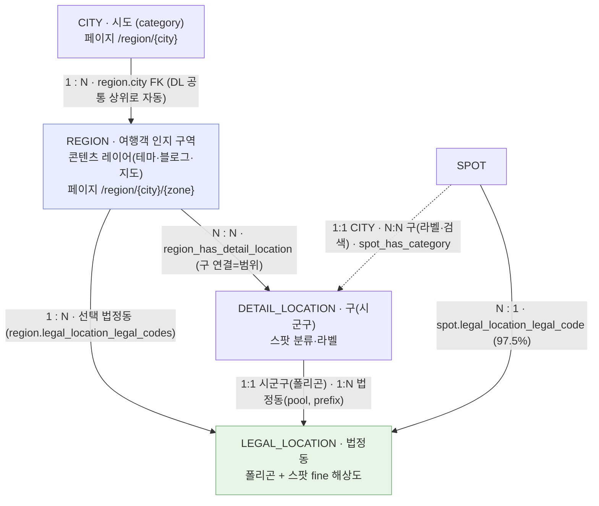

# 지역(Region) 도메인 개선 — 통합 기획서

작성일: 2026-07-01 · 최종 갱신: 2026-07-14
상태: **확정** — 지리모델·CITY 규칙·테마축·정비 방식 이해관계자 동의 완료(2026-07-08), 실행 착수 가능.

> 🧭 **문서 허브** — 이 문서가 지역 개선의 허브다. 각 슬라이스의 상세는 **§8의 스포크 문서**가 정본으로 소유하고(한 사실 한 곳), 마스터는 요약·결정을 소유한다. 결정이 바뀌면 정본 스포크 + 마스터 요약만 갱신한다.

**확정 모델 (한눈에)**
- **분류(뼈대)**: `CITY = 시도(L1)` · `DETAIL_LOCATION = 시군구(L2)` — 스팟이 매달리는 라벨
- **콘텐츠(큐레이션)**: `REGION` = CITY 1개 아래 구(DL) 묶음 + 그 하위 법정동(L3) 선택으로 그린 인지 구역
- **기하·필터**: `LEGAL_LOCATION` = 지도 폴리곤 + 스팟 fine 해상도(`spot.legal_code`, 97.5% 보유)
- **스팟 노출**: REGION = 선택 법정동 ∩ `spot.legal_code` / CITY = `spot_has_category` 전체(B-2)
- **IA**: 도시 → 도시상세 → 구역 → 테마 (4단 slug)

> **한 줄 요약** — 크리에이트립의 '지역'은 목적이 다른 4개 체계(행정·분류·콘텐츠·마케팅)가 역할 없이 겹쳐 방치돼 있다. 이를 **분류(CITY·DETAIL_LOCATION) / 콘텐츠(REGION) / 기하(LEGAL_LOCATION)** 로 역할을 갈라 정립하고, REGION을 '행정 폴리곤에 매인 단일 동네'에서 **여행객이 인지하는 큐레이션 구역**으로 재정의한다. 그 위에 테마(의도) 축과 4단 IA를 얹어, 수요(외부 담론 55%)와 페이지(트래픽 3.8%·참여 11초)의 격차를 메운다.

---

## 1. 왜 하나 — 배경·문제

세 가지가 동시에 같은 곳을 가리킨다.

1. **수요 vs 트래픽 격차** — 외부 여행 담론(r/koreatravel 10,001건)의 **55.5%가 '지역'**인데, 지역 페이지는 스팟 리스트 트래픽의 **3.8%**만 받고 평균 **11초**만에 이탈(리스트 49초의 22%). 끝까지 본 5%는 스팟으로 전환 → 콘텐츠 가치가 0이 아니라 **구조가 수요와 어긋남.**
2. **분류 축 불일치** — 같은 스팟 풀을 '추천·최신·인기'(신선도) 렌즈로 16개 섹션에 반복. 유저가 원하는 **의도(볼거리·교통·투어)·다도시·지역간 이동** 축이 없다.
3. **도메인 4층위 혼재·방치** — '지역'이 ①행정(legal_location) ②운영분류(category) ③콘텐츠(region) ④마케팅(landing_area)으로 역할 없이 평행 존재. region 514개 중 공개 13개, 대부분 자동생성 후 방치.

부가로 **SEO 미수취** — '도시×테마'(seoul restaurants)·'도시×구역'(seoul gangnam) 등 월 1만~10만 대형 키워드(합산 추정 월 ~50만)를 받을 페이지 구조가 없다.

→ 답은 "섹션을 더 쌓는 것"이 아니라 **분류 축을 유저 인지(구역)·의도(테마)로 바꾸고, 4개 개념의 역할을 정립하는 것.**

---

## 2. 개선 방향 (핵심 전환 4가지)

| # | 전환 | Before | After |
|---|---|---|---|
| T1 | **REGION 재정의** | 행정 폴리곤에 매인 단일 동네(명동=regionId 4) | 여행객 인지 큐레이션 구역(강남 = 강남구+서초구) |
| T2 | **스팟 조회 축** | `region.legal_codes` 프리픽스 LIKE (ST_Contains 버그로 무력) | REGION 스팟 해상도 = **법정동(legal)** — 선택 법정동 ∩ `spot.legal_code`. `spot_has_category`(구)는 라벨·검색용 |
| T3 | **콘텐츠 축** | 신선도·인기(추천/최신/인기 반복) | **테마(유저 의도) 축** — 운영자 REGION별 섹션 편성 + 테마 leaf SEO |
| T4 | **정보구조(IA)** | `/spot/region/{숫자 id}` 평면 | **도시 → 도시상세 → 구역 → 테마** 4단 slug |

토대 = **개념 역할 정립(§3)**, 선행 = **데이터 정비(§4)**.

---

## 3. 개선된 개념 구조 (본 문서의 핵심)

### 3-1. 역할 3분할 — 분류 / 콘텐츠 / 기하·필터

현재는 네 개념이 역할 없이 겹친다('홍대' 지역과 '홍대' 상세지역이 같은 이름·단위). 역할을 갈라주면 겹침이 사라진다.

| 역할 | 개념 | 정체성 | 테이블 |
|---|---|---|---|
| **분류 (뼈대)** | CITY · DETAIL_LOCATION | 스팟이 매달리는 라벨. "이 스팟은 서울/성동구". DL은 **구(행정구) 단위만** | `category`(CITY/DETAIL_LOCATION) + `spot_has_category` |
| **콘텐츠 (큐레이션)** | REGION | 유저에게 보여줄 '인지 구역'. **구 연결 + 그 구의 법정동 선택**으로 그림. 테마·블로그·지도 | `region` + `region_has_*` |
| **기하 + 스팟 필터** | LEGAL_LOCATION | 지도 경계·좌표 **+ 스팟 fine 해상도**. 구 DL에 법정동 1:N, REGION은 선택 법정동으로 필터·폴리곤 상속 | `legal_location` + `spot.legal_location_legal_code` |
| *(탐색축)* | SUBWAY | '주요 역' 탭 — 역 주변 스팟 발견 | `category`(*_SUBWAY) + `region_has_subway` |

### 3-2. 개념 관계도 · 카디널리티



**REGION 스팟 노출** = 스팟의 `legal_code`가 REGION이 선택한 법정동 집합에 속하면 노출. (성수 REGION = 성동구 연결 + {성수동1가·2가} 선택 → 그 2개 법정동 스팟만, 옥수동 제외.)

| 관계 | 카디널리티 | 연결 |
|---|---|---|
| CITY : REGION | 1 : N | `region.city` FK — **REGION 편집 시 선택 DL의 공통 상위로 자동 결정**(수동 배선 아님) |
| REGION : DETAIL_LOCATION(구) | N : N | `region_has_detail_location` — REGION의 구 범위(법정동 picker scope) |
| REGION : LEGAL(법정동) | 1 : N | REGION이 선택한 법정동 집합 (`region.legal_location_legal_codes`) |
| DETAIL_LOCATION(구) : LEGAL | 1:1(시군구) + 1:N(법정동) | 1:1=폴리곤 / 1:N=법정동 pool(`legal_code LIKE '구코드%'` 자동 도출) |
| SPOT : LEGAL(법정동) | N : 1 | `spot.legal_location_legal_code` — fine 해상도 키(6,281/6,444=97.5%) |
| SPOT : CITY | 1 : 1 | `spot_has_category` (필수 앵커) |
| SPOT : DETAIL_LOCATION(구) | N : N | `spot_has_category` — 카드 라벨·검색 facet |

**granularity 해법**: 관광지·동을 DL에 두지 않고, REGION을 "구 연결 + 그 구의 법정동 중 선택"으로 만든다. 스팟은 이미 가진 `legal_code`로 필터되므로(성수동만, 옥수동 제외) 구 하위 변별이 유지된다. → 신규 동 row·스팟 재태깅 불필요(§7-3).

### 3-3. 개념별 상세 역할

**① CITY (시도) — 분류의 최상위 + 콘텐츠 그릇**
- **레벨**: 시도(L1) — 서울특별시·경기도. 현재 시/군(169, 잡값 포함)에서 시도로 승격(이해관계자 동의 완료 2026-07-08). 스팟에 직접 노출되는 값이라 라벨 표기가 바뀜(예: 스팟 CITY `의왕시` → `경기도` + DL `의왕시`) → 광역시 외 CITY 스팟 일괄 마이그레이션.
- **엔티티**: `category(type=CITY)`. 모든 스팟의 **필수 단일 앵커**(스팟당 1.0). 생성 = LEGAL L1 선택 + 자유 텍스트 채널('한국' 등 legal 없는 값 유지, '평양' 제거 — D4).
- **페이지 `/region/{city}`**: 카드 메타(대표이미지·태그·설명)·slug·도시간 이동만 저장. 상세 본문 스팟 = **B-2**(그 CITY에 `spot_has_category`로 연결된 스팟 전체)를 **home-nav MAIN_RESERVATION 테마축**(§5-2)으로 분할. 완전집합이라 항상 충분(부산·제주 공백 자동 해소).
- **페이지 존재 = REGION 무관** — 스팟 있는 시/도면 성립(REGION 없어도 CITY 페이지 가능).
- **REGION→CITY = 자동 도출** — REGION 편집에서 구(DL) 선택 → 그 DL들의 공통 상위 CITY로 자동 결정(다른 시/도 구 혼합 금지). `region.city` FK가 저장.
- **CITY 편집(콘텐츠 레이어) = `/region`** — 카드메타·slug·도시간 이동·활성화만 편집(지역 페이지 노출값이라 지역 어드민에 둠). 엔티티 생성·이름(다국어)은 분류 레이어 `/location` '도시' 탭.
- **활성화 게이트**: image·tags·desc.
- **폴리곤**: CITY가 자기 legal(서울=11) 보유 → 도시 경계.

**② DETAIL_LOCATION (구) — 시군구(L2), LEGAL 전량 시딩**
- **생성**: 시군구는 LEGAL_LOCATION(L2)에서 **스크립트로 전량 시딩**(상위 CITY·법정동 코드 자동 바인딩). 어드민에 시군구 생성 UI 없음(구조·바인딩 read-only), 어드민은 **이름(다국어)만 편집**. 신규 시군구(행정구역 개편)는 시딩으로만 추가.
- **자유 텍스트 엔티티 생성은 CITY에만**(D1-a) — DL은 legal 시군구 기반. 국내 시군구는 legal이 완전한 원천이라 DL 자유입력은 재오염 경로(고아·관광지·잡값)만 연다. ※ 엔티티 자유생성 ≠ 이름 자유입력(DL 다국어 이름은 유지).
- **범위**: 현재 158개 → **구(행정구) ~55개만 잔존**. 관광지·동형 103개는 삭제, '관광지' 개념은 REGION으로 이관(§4-1).
- **역할**: 구 라벨·검색 facet(`spot_has_category`) + REGION의 구 범위(`region_has_detail_location`) + 법정동 pool 보유(DL:LEGAL 1:N).
- **granularity**: 법정동으로 해결 → 동을 DL에 만들 필요 없음, 스팟 동 재태깅 없음.
- **스팟 정리**: 삭제되는 관광지·동 DL에 걸렸던 스팟은 소속 구로 `spot_has_category` 재태깅(라벨용). 소속 구는 `spot.legal_code` prefix로 도출.

**③ REGION (지역) — 여행객 인지 구역 (유일한 '콘텐츠' 자산)**
- `region` 514개(공개 13). 개선 후 = **구 연결 + 법정동 선택으로 그린 인지 구역**. 두 결:
  - **광역 묶음형**: 강남 = 강남구+서초구의 법정동들 (여러 구).
  - **관광지형**: 성수 = 성동구 연결 + {성수동1가·2가} 선택 (한 구의 일부 법정동만).
- **스팟 노출**: 선택 법정동에 `legal_code`가 속한 스팟.
- **콘텐츠**: 테마 섹션(어드민 CMS) · subway · blog · persona 큐레이션.
- **폴리곤**: 선택 법정동들의 union → 관광지형도 실제 범위(성수동)만큼 정확. 광역형은 여러 구 union.
- **어드민 생성 흐름**: ① 구(DL) 연결 → ② 그 구의 법정동 pool에서 선택 → ③ 테마·subway 편성. (CITY는 ①의 공통 상위로 자동)

**④ LEGAL_LOCATION (법정지역) — 지도 기하 + 스팟 fine 해상도**
- `legal_location` 5,332행(시도17/시군구250/법정동5,065), 정부 표준 + GeoJSON. 정부 동기화(관리 대상 아님).
- **두 역할**: (a) 지도 폴리곤·좌표 판정, (b) REGION 스팟 fine 해상도 — 스팟이 `spot.legal_location_legal_code`(97.5% 보유)로 REGION의 선택 법정동에 매칭.
- 구 DL과 1:1(시군구 폴리곤) + 1:N(법정동 pool, prefix 자동).
- `/map` 지역뷰 `ST_Contains` 인자 반전 버그 **수정 완료** → legal 판정 신뢰 가능.
- ※ `legal_location.category_code`(전 행 강릉시 default)는 legal→category 방향이라 위 스팟 해상도와 무관(혼동 주의).

**⑤ SUBWAY (지하철) — 접근·발견 탐색축 (독립)**
- `category(MAIN_SUBWAY 11 / MIDDLE_SUBWAY 478)`. 스팟이 인근 역에 다중 태깅(역 5.4/스팟).
- DETAIL_LOCATION과 완전 독립. REGION의 '주요 역' 탭으로 활용(`region_has_subway`).

### 3-4. Before / After 한눈 비교

| 항목 | 현재 | 개선 후 |
|---|---|---|
| REGION 정체 | 행정 폴리곤 = 단일 동네 | 구 연결 + 법정동 선택으로 그린 인지 구역 |
| DETAIL_LOCATION 범위 | 행정구·관광지·동 혼재(158) | 구만(~55) — 관광지·동은 REGION |
| REGION 스팟 조회 | legal 프리픽스(버그로 무력) | REGION 선택 법정동 ∩ `spot.legal_code` |
| legal 활용 | region↔legal 프리픽스(무력) + DL↔legal 없음 | 구:법정동 1:N(prefix 자동) + REGION 선택 법정동 + spot.legal 필터 |
| 콘텐츠 축 | 신선도·인기 | 테마(의도) — 운영자 편성 |
| CITY | region의 속성(citySlug) | URL 1급 + CITY 스팟을 테마로 뿌리는 페이지(B-2). 카드메타·도시간이동은 `/region`서 편집 |
| URL | `/spot/region/4` | `/region/seoul/gangnam/restaurants` |

---

## 4. 데이터 정비 (P0 선행)

개선 IA의 '구역 필터'는 DETAIL_LOCATION 위에 서므로 정합성 정리가 최우선 선행이다. 상세 작업명세는 `[260630] region-data-cleanup-spec.md`(V-5).

**정비 방식 — LEGAL 정합·비파괴** (`geo-model §0-3`)
- ① 링크(스팟·블로그·어학당·region) 있는 카테고리는 삭제 안 함, 레벨 어긋나면 in-place 재타입(코드 보존)
- ② LEGAL의 해당 레벨 값이 없을 때만 생성(있으면 재사용)
- ③ 스팟은 `legal_code`로 CITY(L1)·DL(L2) 일괄 세팅
- ④ '한국'·해외값은 자유입력 유지
- ⑤ 완전 무연결 값만 제거

**관광지·동 DL은 즉시 삭제하지 않는다** (유저 무중단) — 정비~대응 REGION 추가 사이에도 관광지명(홍대·명동)으로 탐색하는 유저가 있어 미리 지우면 그 창 동안 탐색이 끊긴다. 순서(홍대 예):
1. 마포구 DL 확보
2. '홍대' REGION 생성(마포구 연결 + 홍대권 법정동 선택)
3. cutover — 스팟 '홍대' 링크 마포구로 정리 + blog·어학당 마포구 이관
4. 홍대 DL 삭제 (**REGION 이관 트랙 = 후속**)

### 4-1. DETAIL_LOCATION 158 최종 분류

| 분류 | 수 | 처리 | legal |
|---|---:|---|:---:|
| 행정구(구·시·군) | **55** | 유일하게 잔존. REGION 묶음 키 · legal 1:1 | ✅ |
| 관광지명 | 82 | 삭제 — 스팟은 소속 구로 교체, 개념은 REGION 이관 | ❌ |
| 동 | 16 | 삭제 — 소속 구로 교체·REGION 이관 | ❌ |
| 중복(서면 3→1 / 성수동 2→1) | 5 | 삭제 | ❌ |

*(수치 이력: 초기 문서는 행정구 59/관광지 81/동 18, V-3 재검증으로 55/82/16 확정.)*

### 4-2. legal 연결 현황·목표 (세 방향 — 혼동 주의)

- **스팟 → legal (`spot.legal_location_legal_code`)**: ✅ 이미 살아있음 — 6,281/6,444=**97.5%**가 법정동 코드 보유. REGION fine 해상도의 핵심 자산(신규 작업 아님).
- **DL(구) → legal (`category.legal_code`, 신설)**: 구 55개에 붙임 — 시군구(L2) 1:1(폴리곤) + 법정동(L3) 1:N(pool, prefix 자동). 이름 자동매칭 49 / 수동 6(중·동·서·남·북구 동명 복수 / 강서구 서울 판별).
- **legal → category (`legal_location.category_code`)**: 전 행 강릉시 default = 무의미(방치). 위 두 방향과 무관.

### 4-3. 그 밖의 정비

- **비-행정구(관광지·동) 처리** — 스팟은 `legal_code`로 소속 시군구 DL에 자동 재태깅, 블로그·어학당은 legal_code 없어 소속 구로 수동 이관. 소속 시군구 DL은 LEGAL L2 생성으로 존재(예: 강릉시는 DL, 그 CITY는 강원특별자치도). 실제 삭제는 대응 REGION 생성 후 REGION 이관 트랙(후속).
- **완전 무연결 즉시삭제** — 스팟·블로그·어학당·region 0인 비-행정구 = 청주공항 1건(실행 시점 재확인).
- **빈 구 13개** — 행정구라 무연결이어도 유지(legal 앵커).
- **RG-1** — 비공개 REGION 500개 삭제(`id 25~531`, 2025-02-14 벌크). 검증: 삭제집합 내 공개 0·하드코딩 id 4·5·15 안전 ✅.
- **RG-3** — `region_spot_area_has_spot` 27링크 정리(스팟 직접 region 연결 해제).
- **AD-5** — 어드민 카테고리 생성에 상위 도시(parent) 입력 + `createCategory` type 화이트리스트 → 고아·잡값 재오염 차단.

---

## 5. 정보구조(IA) · 페이지 설계

### 5-1. 4단 IA

```
① /region                                도시 인덱스 (지도 + 도시 선택 + 도시간 이동)
② /region/{city}                         도시 상세 (구역 그리드 + 도시간 이동 + 블로그 + 테마 캐러셀)
   └ /region/{city}/{theme}              도시×테마 leaf  ('seoul restaurants' 월 1만~10만) ★
③ /region/{city}/{zone}                  구역(REGION) 상세 (섹션·subway·persona·지도 + 테마 캐러셀)
   └ /region/{city}/{zone}/{theme}       구역×테마 leaf  ('gangnam restaurants' 롱테일)
```

- **3번째 칸(zone/theme 공유)** = city별 슬러그 레지스트리 `(city, slug)→{zone|theme}` + 어드민 유니크 가드로 판정(zone=지명·theme=의도명사라 충돌 사실상 0).
- 기존 `/spot/region/{숫자 id}` → 새 slug **301 리다이렉트**(498 동네 URL SEO 승계).

### 5-2. 테마 — CITY 축과 REGION 축이 다름

- **CITY 레벨 테마 = `home-navigation`(MAIN_RESERVATION 단일 카테고리) 재사용.** 신규 CMS 없이 기존 home-nav(CATEGORY 아이템·`categoryCode` 1개·`priority`)를 CITY 페이지 테마축으로 씀.
  - CITY×테마 = `category(CITY) ∩ home-nav MAIN_RESERVATION 카테고리` → 단일 카테고리라 `/spot/list?category={id}&order=MostViewedInAMonth`로 표현 가능. 섹션 순서 = home-nav `priority` 전역 1개(도시별 정렬은 후속). URL 타입 아이템 제외.
  - 코드 근거: `backend/apps/trip/src/modules/home-navigation/`, 프론트 `homeNavigations(language)`·`HomeNavigationItem`·`filterHomeNavigations.ts`.
- **REGION(zone) 레벨 테마 = `region_section`(자유 편성: 이름+카테고리+순서, 멀티카테고리 가능).** 구역×테마 leaf = REGION 선택 법정동 ∩ 섹션 카테고리. 멀티카테고리라 `/spot/list` 단일필터로 표현 불가 → leaf 전용 쿼리.
- **노출 = 캐러셀 + leaf**: monthly best 상위 9 캐러셀 + 스팟 ≥10이면 "전체 보기" → leaf.
- **SEO 가드레일(필수)**: 콘텐츠 임계 10(미만 leaf 생성·색인 안 함), 테마 leaf = canonical 정본(`/spot/list?category=` 필터뷰 noindex 양보), 안정 slug(home-nav `?category={id}` 쿼리 → `/region/{city}/{theme}` 정적 slug 위해 category→slug 매핑 필요), 짧은 에디토리얼 인트로.

### 5-3. 서울 테마 구성 (수요×공급) — 상세: `[260623] region-seoul-theme-spec.md`

- **수요·공급 역전**: Reddit 수요 1·3위(명소 72.5%·교통 52.8%)의 서울 공급은 최하위(명소 50·교통 7). 공급 1~3위는 뷰티/체험 버티컬.
- 권장 배치: **A 간판**(체험·미식·투어·인생사진) → **B 노출우선·공급확충**(명소·교통) → **C K-뷰티·웰니스 묶음** → **D K-pop**. 쇼핑·숙소는 별도 도메인 크로스셀.

---

## 6. 실행 로드맵

> 의존성: 데이터(P0/P1) → REGION·CITY 생성 → 파라미터(P3) → UI(P4). 유저 페이지 배포는 데이터 생성 완료 후.

| Phase | 범위 | 핵심 작업 | 의존성 |
|---|---|---|---|
| **P0** | 데이터 정합성 + REGION 생성·cutover | ① CITY/DL legal 정합 + AD-5 `[260701-cleanup]` → ② 스팟 재태깅 1차(일반·CITY승격) `[260701-cleanup]` → ③ RG-1(비공개 REGION 500 삭제)·RG-3(27링크) → ④ REGION 어드민 개선(법정동 picker) → ⑤ 관광지 REGION 생성·연결 + 공개 13개 재배선 → ⑥ 표기·검색 cutover + 관광지 스팟 재태깅·blog·어학당 이관 `[260708]` → ⑦ 관광지형 DL 삭제 | — |
| **P1** | CITY 유저페이지 준비 | CITY 카드메타 입력·활성화(image·tags·desc) | P0 |
| **P3** | 파라미터/BE | 조회 축 전환(BE-1) · 폴리곤 resolve(BE-2) · slug 라우팅+레지스트리(BE-3) · 테마 leaf/캐러셀 쿼리(BE-4) · region_section(BE-5) · CITY 집계(BE-6 = CITY 스팟 ∩ home-nav MAIN_RESERVATION) · subway/blog/persona(BE-7·8) | P1, 와이어프레임 |
| **P4** | UI | 4단 라우팅·301 · CITY/REGION 페이지 · 테마 캐러셀+leaf · 폴리곤 렌더 | P3 |
| **유입** | 리스트→region 동선 | 스팟 리스트(49초)에 '지역으로 둘러보기' 위젯 → `/region` | P1 출시 + 활성화 검증 후 |

**외부 게이트 — 스팟 multi-detail_location(1→2개)** (`[260617]`). **의존도 낮음**: REGION 스팟 해상도는 `spot.legal_code`(단일 법정동)로 처리되므로 재태깅·granularity에 multi-DL 불필요. multi-DL은 카드 두 구 라벨 병기·검색 확대용 편의로 별 트랙 진행 가능.

---

## 7. 성공 지표 · 리스크

### 7-1. 지표 (회의록 합의 6·7)

- 문제는 **활성화(11초)와 유입(3.8%)의 동시 고장**, 전환(5%)은 정상.
- **1차 = 활성화**: 참여시간 11초 → 목표·이탈률. 첫 화면(above-the-fold)에 의도 답(테마·이동 카드) 배치로 직격.
- **후행 = 유입**: 리스트→region 동선. 활성화 검증 후 개방(깨진 페이지에 트래픽 먼저 붓지 않음).
- **가드레일**: 스팟 이동률 5% 유지.

### 7-2. 리스크

| 리스크 | 내용 | 대응 |
|---|---|---|
| 콘텐츠 공백 | region 514개 중 498 서울, 부산·제주 각 1개 | **B-2** — 도시 페이지 스팟 = category(CITY) 전체를 home-nav 테마축으로 분할. 완전집합이라 공백 자동 해소, 에디토리얼만 후행 |
| 임팩트 천장 | 3.8% 베이스 → 활성화만으론 전사 임팩트 작음 | 유입 트랙 병행 필수 |
| RG-1 삭제 안전성 | 벌크 500 삭제 | ✅ 공개 0·하드코딩 id 안전 검증 완료 |
| spot.legal 정확도 | 코드 스팟 6,285 | ✅ 전수 점검(2026-07-01) — 유효 **99.7%**(경계 내 93.3% + 경계≤55m 6.4%), 실오배정 20건(0.3%)·dangling 0. 미코드 159건 backfill + 오배정 20건 보정만 대상 |
| 미해결 결정 | empty 구 13개 노출 여부 / REGION 생성 시 법정동 선택 운영 부담 | cleanup-spec §4 |

### 7-3. granularity 해법 — 확정 (구 연결 + 법정동 선택)

관광지 DL을 삭제해도 구 하위 변별을 잃지 않는다: REGION을 "구 DL 연결 + 그 구의 법정동 중 선택"으로 만들고, 스팟은 이미 가진 `legal_code`로 필터한다.

- 예: 성수 REGION = 성동구 연결 → 법정동 pool 17개 중 {성수동1가·2가}만 선택 → `legal_code∈{11200114,11200115}` 스팟만 노출. 옥수동·왕십리 제외.
- **비용**: 신규 동 DL 0 · 스팟 동 재태깅 0(legal 이미 97.5% 보유). 구:법정동 pool은 prefix로 자동. 폴리곤도 선택 법정동 union이라 관광지 범위만큼 정확.

---

## 8. 문서 허브 맵 (이 문서가 허브)

> 규칙: **한 사실은 한 곳.** 마스터는 요약+결정을 소유하고, 아래 🟢스포크가 각 슬라이스의 상세 정본을 소유한다(갱신은 스포크에서). 📚아카이브는 역사·근거로 수정 금지.

**🟢 살아있는 스포크 — 상세 정본**

| 문서 | 마스터 앵커 | 정본 소유 |
|---|---|---|
| `plans/[260701] region-geo-model-decision.md` | §3 | 지리모델 D1~D7 결정·근거 |
| `plans/[260630] region-data-cleanup-spec.md` (V-5) | §4 | DETAIL_LOCATION 정리 시퀀스·리스트 |
| `plans/[260622] region-restructure-project.md` | §6 | 작업분해(Phase/BE/FE/AD)·D1~D10 |
| `plans/[260623] region-seoul-theme-spec.md` | §5-3 | 서울 테마→카테고리 매핑 |
| `jira/region/[260701] region-detail-location-cleanup.md` | §4 | DL 정비 실행 요구사항 |
| `jira/region/[260708] region-display-and-search.md` | §5 | 스팟 지역 표기·검색 요구사항 |
| `jira/region/[260715] region-creation-and-cutover.md` | §4·§6 | P0 REGION 트랙(어드민 picker·관광지 REGION 생성·RG정리·DL cutover) 요구사항 |
| `jira/spot/[260706] spot-list-seoul-busan-region-toggle.md` | §5 | 리스트 지역 토글 요구사항 |
| `jira/spot/[260617] spot-multiple-detail-locations.md` | §6(게이트) | 스팟 복수 상세지역(별트랙) |

**📚 아카이브 — 역사·근거 (수정 금지)**

| 문서 | 역할 |
|---|---|
| `research/[260618] region-domain-map.md` | 4층위·어드민 운영·데이터 부채 |
| `reddit-koreatravel/[260612] REPORT_region_deepdive.md` | 지역 수요 55.5%·다도시 27%·도시 지문 |
| `meetings/region/[260619] …0619.md` | 합의 1~15 (논의 원문) |
| `proposals/[260624] proposal_region-domain-renewal.md` | 최초 개념 재정의 제안 |
| `proposals/[260702] proposal_region-geo-model-realignment.md` | 지리모델 재정렬 제안 (승인·역할 종료) |
| `jira/map/[260305] map_region_view_bug.md` | 지도 좌표버그 (수정 완료) |
